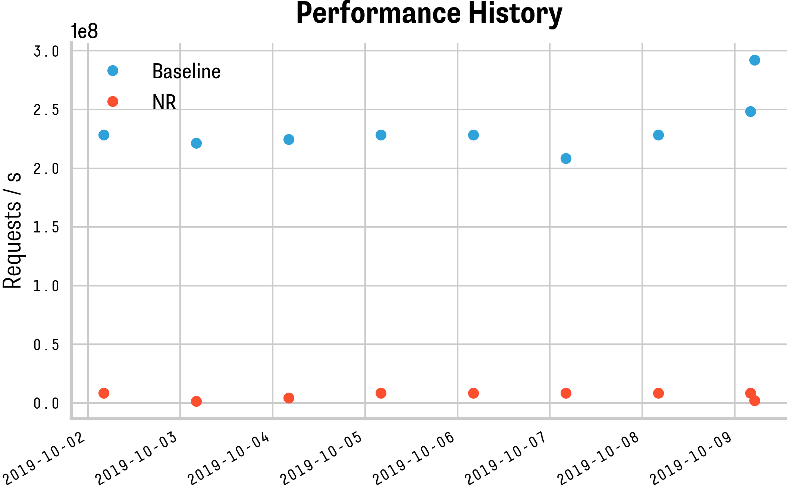

# phdplot
Make nice plots with matplotlib.

## Set-up

On Ubuntu 14.04, install the following packages:

```
$ sudo aptitude install python-tk libfreetype6-dev python-pip
$ sudo pip install matplotlib palettable pandas
```

The sample demos use two custom fonts: Supria Sans and Decima Mono. You can install those in your `.fonts` folder and
afterwards matplotlib should be able to find and use them.
Make sure you update your font cache after if you install new fonts:
```
$ fc-cache -vf ~/.fonts/
```

## Lineplots


## Barcharts


## Heatmaps


## Timeseries

